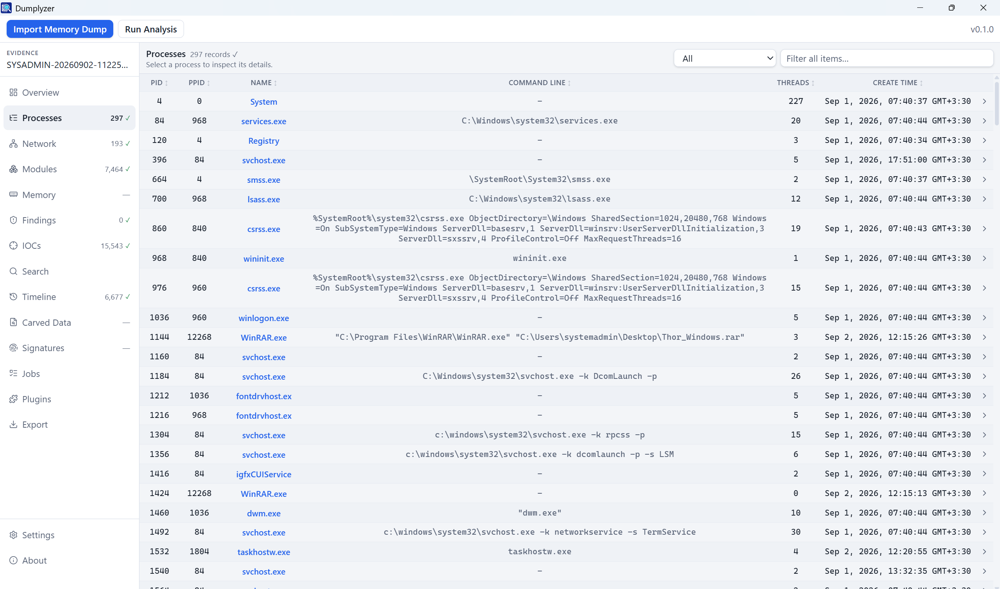
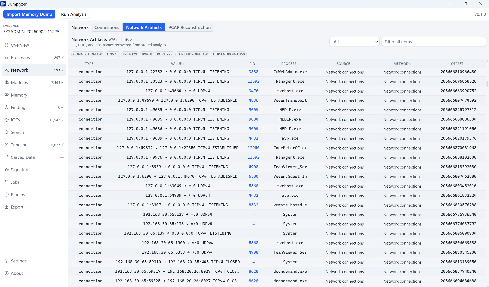
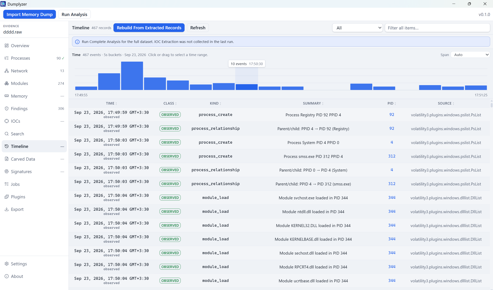
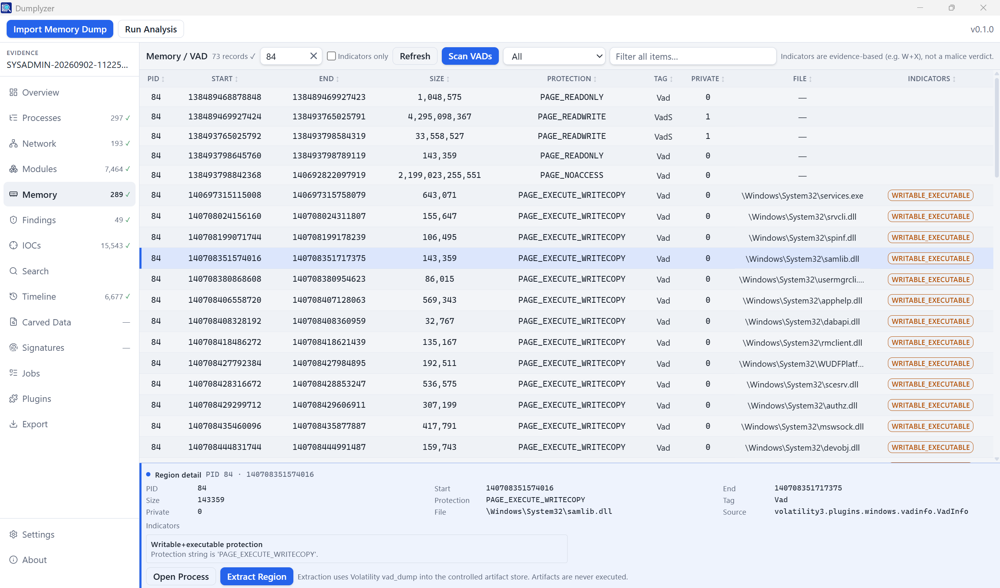

<p align="center">
  
</p>

<h1 align="center">Dumplyzer</h1>
<h3 align="center">Advanced Memory Forensics Platform</h3>

<p align="center">
  
  
  
  <a href="CONTRIBUTING.md#tests"></a>
  <a href="CONTRIBUTING.md#tests"></a>
  <a href="CONTRIBUTING.md#tests"></a>
  <a href="docs/clean-machine-validation.md"></a>
  <a href="https://github.com/EmadAbedini/Dumplyzer"></a>
  <a href="LICENSE"></a>
  <a href="SECURITY.md"></a>
  <a href="https://www.linkedin.com/in/emad-abedini"></a>
</p>

Dumplyzer is an open-source, local-first desktop workbench for memory forensics. It brings processes, network activity, indicators, reconstructed binaries, and signatures into one local investigation workspace, without assembling a separate forensic toolchain.

<p align="center">
  <a href="docs/assets/screenshots/01-processes.png"></a>
  <a href="docs/assets/screenshots/02-network.png"></a>
</p>
<p align="center">
  <a href="docs/assets/screenshots/03-timeline.png"></a>
  <a href="docs/assets/screenshots/04-memory.png"></a>
</p>

Analysis runs locally. The original memory image stays at its imported location. There is no cloud analysis, no account system, no telemetry, and no phone-home. Dumplyzer does not produce a malware verdict.

<p align="center">
  <a href="#install"><strong>Install</strong></a> ·
  <a href="#features"><strong>Features</strong></a> ·
  <a href="#windows-kernel-symbols"><strong>Kernel symbols</strong></a> ·
  <a href="#analysis-components"><strong>Analysis components</strong></a> ·
  <a href="#architecture"><strong>Architecture</strong></a> ·
  <a href="#documentation"><strong>Docs</strong></a>
</p>

---

## Features

- **One installer.** Python, the analysis engine, and supporting tools ship inside the Windows package. End users do not install a developer toolchain.
- **Local-first by design.** Analysis runs on the workstation. There is no cloud analysis, no account system, no telemetry, and no phone-home. Dumplyzer does not open a network listener. Explicit Microsoft downloads are limited to two documented cases: WebView2 during setup if the runtime is missing, and a matching Windows kernel PDB when you start Windows analysis (see [Kernel symbols](#windows-kernel-symbols)).
- **Evidence stays put.** Dumplyzer records path, hash, and metadata. It does not copy the dump into Program Files or the user-data tree.
- **Windows kernel symbols on demand.** Windows memory analysis needs type information for the NT kernel that was running when the dump was taken — the PDB (or Volatility ISF) for **that OS build**, not a generic pack. **Download & Continue** is the recommended path; you can instead browse to a matching file.
- **Windows and Linux evidence.** Import supported Windows and Linux memory images, including crash dumps, LiME, ELF cores, QEMU/VMware snapshots, and raw physical memory. Quick Triage and Complete Analysis currently provide the guided Windows Volatility workflow (processes, modules, handles, VAD, and related views). Linux evidence can be explored through Plugin Explorer using supported `linux.*` plugins.
- **Two analysis modes, plus custom.** **Quick Triage** is a first look (OS/symbol status and the process list). **Complete Analysis** is the evidence-wide pass for processes, command lines, modules, network connections, handles, findings, IOCs, network artifacts, and timeline. **Custom Analysis** runs only the capabilities you select. Heavier jobs stay explicit so a triage run does not walk the whole dump or write reconstructed binaries.
- **Process analysis.** Process list, command lines, loaded modules/DLLs, open handles, and parent/child relationships (PPID, with a per-process Family view).
- **Network.** Network connections extracted from the image, plus network indicators and on-demand PCAP reconstruction. Reconstruction builds a `.pcap` from recoverable Ethernet/IP records in the dump; matching flows can be exported. Connection metadata is not a packet capture, and a reconstructed PCAP is not a full original capture.
- **IOCs.** Indicators extracted from stored process, module, network, and handle data — IPs, domains, URLs, mutexes, registry keys, paths, and MD5/SHA-256 hashes.
- **Search and timeline.** Indexed lookup across stored artifacts, plus an investigation timeline with time-range filtering. Search reads what analysis already stored; it does not rescan the dump.
- **Memory regions.** Inspect VAD / virtual-memory regions for a selected PID.
- **Signatures and capabilities.** YARA scans of the dump and/or extracted PE files (42 bundled Dumplyzer rules, plus your own `.yar` / `.yara` files). YARA matches are investigation indicators, not malware verdicts. CAPA reports capabilities of reconstructed PE files, not malware verdicts.
- **Carved strings.** bulk_extractor recovers emails, phone numbers, URLs, IPs, MAC addresses, HTTP logs, AES key candidates, and similar features from the dump.
- **PE reconstruction.** Rebuild EXE/DLL images from process memory. Reconstructed files are extracted artifacts, not malware, and are never executed.
- **Plugin Explorer.** Discover and run supported Volatility 3 plugins from the UI, with cached results and job history.
- **Reports.** Export HTML, JSON, or Excel under the user-data `exports\` directory. HTML reports are static (no JavaScript, no CDN).
- **Untrusted evidence.** Memory images and extracted artifacts are treated as untrusted. Dumplyzer does not execute them. Matches, strings, and carved features are investigation indicators — not verdicts.

Complete Analysis does **not** auto-run PE reconstruction, signature detection, CAPA, FLOSS, bulk_extractor, or PCAP reconstruction. Start those from the workspace when you need them.

## Investigation workspace

| View | What you get |
|------|----------------|
| Overview | Case snapshot and coverage of what has already run |
| Processes | Process list, command lines, parent/child, and per-process deep dive |
| Network | Connections extracted from the image, network indicators, optional PCAP reconstruction |
| Modules / Memory | Loaded modules, handles, and VAD regions |
| Findings / IOCs / Search | Heuristics, extracted indicators, and cross-view search |
| Timeline | Investigation timeline built from stored records, with time-range filter |
| Carved Data | Reconstructed PE images and carved feature files |
| Signatures | Memory-dump and artifact signature scans, including your own rules |
| Plugins | Supported Volatility 3 plugins against the imported image |
| Export | HTML / JSON / Excel reports of completed analysis |
| Jobs | Background work with real progress when the engine knows it |

A memory image is optional. Empty Evidence is a valid first-launch state.

## Analysis components

Dumplyzer integrates established open-source engines. They are **bundled in the installer** and invoked locally. They are not downloaded when you run a job. The only optional analysis-time download is a Windows kernel PDB, and only after you agree ([Kernel symbols](#windows-kernel-symbols)).

| Capability | Role | Bundled implementation |
|------------|------|------------------------|
| Memory analysis | Processes, modules, network, VAD, plugin explorer | [Volatility 3](https://github.com/volatilityfoundation/volatility3) **2.28.0** (Python APIs, not `vol.py` stdout) |
| PE reconstruction | Rebuild EXE/DLL images from process memory | Engine workflow on top of Volatility 3 |
| Artifact extraction | Carve URLs, domains, IPs, emails, MAC addresses, HTTP logs, AES key candidates, and similar strings from the dump | [bulk_extractor](https://github.com/simsong/bulk_extractor) **2.2.0** (separate process, GPLv3, corresponding source shipped) |
| Signature detection | Scan the dump and/or extracted PE files. Matches are investigation indicators. | yara-python **4.5.4** plus **42** original Dumplyzer rules (memory + artifact). Copy extra `.yar` / `.yara` files into the custom rules folder |
| Capability analysis | Report capabilities of reconstructed PE files, not malware verdicts | [CAPA](https://github.com/mandiant/capa) **9.4.0** (separate process) |
| String analysis | Static and deobfuscated strings from reconstructed PE files | [FLOSS](https://github.com/mandiant/flare-floss) **3.1.1** (separate process) |

## Architecture

```
React + TypeScript UI
        │  Tauri commands / events
Tauri 2 desktop shell
        │  JSON-RPC (NDJSON over stdio — no localhost HTTP port)
Local Python engine
        │  read-only access
Memory image on disk
```

The original memory image remains at its imported location. Dumplyzer stores analysis metadata, indexes, logs, cached symbols, extracted artifacts, and exports under `%LOCALAPPDATA%\Dumplyzer\`. That directory is generated analysis and application data. It is separate from the original evidence and is never written into the install tree.

The UI consumes normalized application data.

```
app/frontend/     Investigation UI (Vite, React, TypeScript)
app/desktop/      Tauri 2 shell, installer, bundled resources
engine/           Analysis engine (Python package name: memscope_engine)
tests/engine/     Engine tests
packaging/        Windows runtime manifest
scripts/          Release and tool-prep scripts
docs/             Release and clean-machine validation
```

Details: [ARCHITECTURE.md](ARCHITECTURE.md).

## Install

There are two ways to get Dumplyzer. **If you want to use the product, use the Windows installer.** Building from source is for contributors.

### 1. Windows installer (recommended)

You do **not** need Python, Node, Rust, or a source checkout. This is the supported way to run Dumplyzer.

1. Download `Dumplyzer_0.1.0_x64-setup.exe` from [Releases](https://github.com/EmadAbedini/Dumplyzer/releases).
2. Run the installer. It defaults to `%ProgramFiles%\Dumplyzer` and requires administrator rights.
3. Launch **Dumplyzer** from the Start menu.

The Microsoft Edge **WebView2** runtime is required. If it is already installed, setup skips it. If it is missing, setup asks to download it from Microsoft, or to install WebView2 yourself and run the installer again. Cancelling that download exits setup.

Windows dumps also need a matching kernel PDB the first time you analyze a given OS build. That is handled in the app, not by the installer — see [Windows kernel symbols](#windows-kernel-symbols).

0.1.0 installers are **unsigned**. SmartScreen or organization policy may warn on first run.

#### Supported platform

| Requirement | Detail |
|-------------|--------|
| Desktop app | Windows 10 22H2+ / Windows 11, x64 |
| Arch | x64 only |
| Evidence | Windows and Linux memory images (crash dump, LiME, ELF core, raw / QEMU / VMware, …) |
| App | **0.1.0** |
| Engine runtime | Bundled CPython **3.12.10** |
| Linux / macOS hosts | Not a release target yet |

**Tested on**

| Edition              | Version | OS Build   | Experience Pack |
| -------------------- | ------- | ---------- | --------------- |
| Windows 11 Pro       | 24H2    | 26100.1742 | 1000.26100.18.0 |
| Windows 10 Pro       | 22H2    | 19045.2006 | 120.2212.4180.0 |
| Windows 10 Education | 22H2    | 19045.6456 | —               |

A separate clean-machine install checklist is recorded in [docs/clean-machine-validation.md](docs/clean-machine-validation.md).

### 2. Build from source

Use this path only if you are developing Dumplyzer. It needs a full Windows developer toolchain. For everyday use, go back to [the installer](#1-windows-installer-recommended).

#### Prerequisites

| Tool | Version |
|------|---------|
| Windows | x64 |
| Python | **3.12.10** (`py -3.12`) — do not use 3.13 for the engine |
| Node.js / npm | **22.18.0** / 10.9.3 |
| Rust / cargo | **1.98.1** (`stable-x86_64-pc-windows-msvc`) |
| MSVC Build Tools | VS 2022 |
| WebView2 | Evergreen |

#### Run the desktop app

From the repository root:

```powershell
py -3.12 -m venv engine\.venv
.\engine\.venv\Scripts\python.exe -m pip install -U pip
.\engine\.venv\Scripts\python.exe -m pip install -e ".\engine[dev]"

cd app\frontend
npm ci
cd ..\desktop
npm ci
npm run tauri dev
```

The first `tauri dev` compiles the Rust shell and can take several minutes. After that, the investigation UI starts against the local Python engine. Empty Evidence is a valid first-launch state.

To keep this session's data separate from an installed copy of Dumplyzer, start again from the repository root:

```powershell
$env:DUMPLYZER_DATA_DIR = "$env:TEMP\dumplyzer-dev"
cd app\desktop
npm run tauri dev
```

#### Produce the Windows installer

This step is heavier: it downloads the pinned CPython embeddable runtime and bundled tools, then builds the NSIS setup EXE. Run it from the repository root. Stop `tauri dev` first if that process is still running.

```powershell
.\scripts\windows\build-release.ps1
```

The installer lands at `app\desktop\target\release\bundle\nsis\Dumplyzer_0.1.0_x64-setup.exe`.

Tests, engine notes, and packaging details: [CONTRIBUTING.md](CONTRIBUTING.md) and [docs/windows-release.md](docs/windows-release.md).

## Windows kernel symbols

Windows memory analysis requires kernel symbols matching the OS build captured in the memory image.

The NSIS installer does **not** ship Microsoft PDBs or the large Volatility `windows.zip` pack. Dumplyzer asks the first time you start **Quick Triage**, **Complete Analysis**, or **Custom Analysis** on a Windows image whose symbols are not already cached. Linux images do not use this path.

Two workflows. **Download & Continue** is recommended.

| Path | When to use |
|------|-------------|
| **Download & Continue** (recommended) | The machine can reach Microsoft. Dumplyzer fetches **only that dump's kernel PDB**, verifies it, converts it to a Volatility ISF, and caches it. Later dumps from the same build reuse the cache. |
| **Browse File** | Air-gapped or policy-blocked networks, or you already have the matching `.pdb` or ISF (`.json` / `.json.xz` / `.json.gz`). The file must match the captured kernel; a PDB from a different build will not analyze that dump. |

Download never starts by itself. You confirm in the dialog. Closing the prompt keeps the imported dump; you can run analysis again when you are ready.

Cached symbols live under `%LOCALAPPDATA%\Dumplyzer\symbols\`, not in Program Files. Uninstall does not remove them unless **Delete app data** is checked.

## Data locations

The original memory image remains at its imported location. Dumplyzer does not copy it into the data directory.

Install binaries and generated analysis data are separate.

| Kind | Location |
|------|----------|
| Install | `%ProgramFiles%\Dumplyzer\` |
| User data | `%LOCALAPPDATA%\Dumplyzer\` |
| Database | `%LOCALAPPDATA%\Dumplyzer\memscope.db` |
| Logs / cache / artifacts / exports | under the user-data directory |
| UI profile (WebView2) | `%LOCALAPPDATA%\Dumplyzer\webview\` |
| Kernel symbols | `%LOCALAPPDATA%\Dumplyzer\symbols\` (per-build PDB/ISF after Download & Continue, or a file you browse to) |
| Signature rules | `%LOCALAPPDATA%\Dumplyzer\rules\yara\` (`bundled\` refreshed on upgrade, `custom\` never overwritten) |

Override the data directory with `DUMPLYZER_DATA_DIR` only for tests or support.

Uninstall keeps user data unless **Delete app data** is checked. That option removes `%LOCALAPPDATA%\Dumplyzer\` (database, logs, cache, artifacts, exports, symbol cache, custom YARA rules, WebView2 profile) and leftover identifier folders such as `%LOCALAPPDATA%\com.dumplyzer.workbench\`. SQLite migrations are additive; opening an older `memscope.db` upgrades the schema and keeps existing evidence.

This product was previously named MemScope. The engine import path remains `memscope_engine`, and the database file remains `memscope.db`. If `%LOCALAPPDATA%\Dumplyzer\memscope.db` does not exist, first launch copies an older data directory from `%LOCALAPPDATA%\MemScope\` or `%APPDATA%\com.memscope.workbench\` when present. The source is not deleted.

## Documentation

| Document | Contents |
|----------|----------|
| [ARCHITECTURE.md](ARCHITECTURE.md) | Layers, IPC, jobs, schema |
| [CONTRIBUTING.md](CONTRIBUTING.md) | Source setup, tests, packaging notes |
| [SECURITY.md](SECURITY.md) | Process model, path confinement, reporting |
| [CHANGELOG.md](CHANGELOG.md) | Release history |
| [THIRD_PARTY_NOTICES.md](THIRD_PARTY_NOTICES.md) | Redistributed components and licenses |
| [docs/windows-release.md](docs/windows-release.md) | How the NSIS installer is built |
| [docs/clean-machine-validation.md](docs/clean-machine-validation.md) | Clean-machine install checklist |

## What Dumplyzer is not

- A malware verdict engine. YARA matches, CAPA capabilities, and carved strings are investigation indicators.
- A cloud analysis service. There is no account, no telemetry, and no off-workstation analysis.
- A replacement for Volatility 3. Dumplyzer uses Volatility 3 as the memory-analysis runtime and exposes supported plugins. The UI consumes normalized application data, not `vol.py` stdout.
- An endpoint detection product. It analyzes imported memory images on a Windows x64 desktop.

## Security and limitations

- Treat dumps and extracted artifacts as untrusted. Dumplyzer does not execute evidence.
- Dumplyzer does not score malware and does not claim a verdict from signatures, capabilities, or strings.
- The desktop application is Windows x64. Linux and macOS hosts are not a release target yet. Evidence is not limited to Windows dumps.
- Unsigned 0.1.0 artifacts may be blocked by SmartScreen until a signed build is published.
- If WebView2 is absent, setup asks before downloading it. Cancelling that download exits the installer.
- Windows analysis needs the kernel PDB for **that dump's OS build**. Dumplyzer asks before downloading it. **Download & Continue** is the recommended path; you can instead browse to a matching `.pdb` or ISF. See [Windows kernel symbols](#windows-kernel-symbols).

See [SECURITY.md](SECURITY.md).

## License

Dumplyzer application source is licensed under the [Apache License 2.0](LICENSE).

The Windows installer also redistributes third-party components under their own terms (CPython PSF, Volatility Software License, pefile MIT, bulk_extractor GPLv3, CAPA/FLOSS Apache-2.0). Dumplyzer does not relicense those projects. See [THIRD_PARTY_NOTICES.md](THIRD_PARTY_NOTICES.md).

## Acknowledgements

Dumplyzer stands on open-source memory-forensics and reverse-engineering work, including [Volatility 3](https://github.com/volatilityfoundation/volatility3), [bulk_extractor](https://github.com/simsong/bulk_extractor), [CAPA](https://github.com/mandiant/capa), [FLOSS](https://github.com/mandiant/flare-floss), and [YARA](https://github.com/VirusTotal/yara).

---

Developed by [Emad Abedini](https://github.com/EmadAbedini) · [LinkedIn](https://www.linkedin.com/in/emad-abedini)
